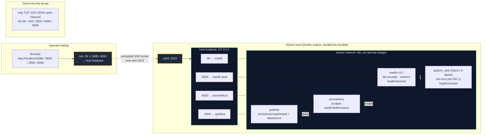

# DevOps Workshop - IaC with Bob (Ansible + Terraform on Ubuntu)

Companion code for [`WORKSHOP-part1-IDE.md`](WORKSHOP-part1-IDE.md) and [`WORKSHOP-part2-CLI.md`](WORKSHOP-part2-CLI.md).

Deploys Traefik + Apache + Prometheus + Grafana on a remote Ubuntu host with **zero public ports** - every container binds to `127.0.0.1`, and the operator reaches them through SSH local-forward tunnels.

## Architecture



**Provisioning order:**
1. **Ansible bootstrap** - installs Docker engine, adds the SSH user to the `docker` group, sets log rotation
2. **Ansible content** - renders Apache page, Traefik dynamic routes, Prometheus scrape config, Grafana datasource + dashboard into `/opt/lab/` on the host
3. **Terraform** - creates the bridge network, the four containers (each binding only to `127.0.0.1`) and the named volumes
4. **`tunnel.sh up`** - opens the four `ssh -L` forwards from the laptop to host loopback

## Quick start (using the provided IBM Cloud VSI)

```bash
export TF_VAR_grafana_admin_password='Workshop!2026'
make deploy            # bootstrap docker -> terraform apply -> ansible content -> tunnels -> curl
open http://localhost:8080      # the app
open http://localhost:3000      # grafana (admin / $TF_VAR_grafana_admin_password)
open http://localhost:8081      # traefik dashboard
make idempotency       # prove TF = no-op and Ansible --check = 0 changed
make self-heal         # kill apache_web on the host, watch it come back
make clean             # tear down tunnels and infra
```

## Overriding the target

The Makefile defaults to the IBM Cloud VSI used to validate this lab. To target a different host:

```bash
make TARGET_HOST=10.0.0.5 SSH_USER=ubuntu SSH_PORT=22 SSH_KEY=~/.ssh/my.pem deploy
```

## Layout

```
infra/
├── ansible/
│   ├── ansible.cfg
│   ├── inventory.ini
│   ├── group_vars/all.yml
│   ├── site.yml
│   └── roles/{common,docker,web_content,monitoring_content}/
└── terraform/
    ├── versions.tf  variables.tf  main.tf  outputs.tf
    └── modules/{network,traefik,web,monitoring}/
tunnel.sh              # open / close SSH local-forward tunnels
Makefile               # deploy / validate / self-heal / clean wrappers
pem_ibmcloudvsi_download.pem   # SSH key (chmod 600)
```

## Prerequisites on the laptop

- `terraform` >= 1.6
- `ansible` >= 2.15
- `ssh`, `curl`, GNU `make`
- The pem file at `pem_ibmcloudvsi_download.pem` (already present), `chmod 600`
